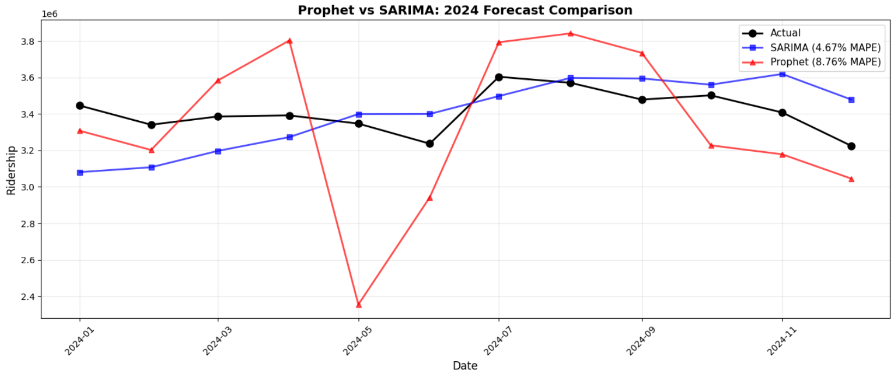

# 🚇 MRT Demand Forecaster

[](https://www.python.org/)
[](LICENSE)
[](https://github.com/popolome/MRT-Demand-Forecaster)

**Time-series forecasting of Singapore MRT ridership — SARIMA achieves 4.67% MAPE on 2024 data, outperforming Prophet and ARIMA across 72 months including COVID-19 disruption.**

---

## 📌 Overview

This project builds and evaluates multiple time‑series forecasting models to predict **monthly MRT ridership in Singapore** (2019–2024). The data includes the massive structural break caused by COVID‑19, making it a challenging real‑world forecasting problem.

**Key result:** A stable **SARIMA(0,1,0)×(1,1,0,12)** model achieves **4.67% MAPE** on a 12‑month test set — a 52% improvement over the ARIMA baseline.

---

## 🎯 Business Problem

- **Goal:** Predict monthly ridership to support capacity planning, staffing, and maintenance scheduling.
- **Challenge:** The COVID‑19 pandemic caused an unprecedented 80%+ drop in ridership, violating classical time‑series assumptions.
- **Constraint:** Only 72 months of data (2019–2024), making complex models prone to overfitting.

---

## 📂 Repository Structure

```text
MRT-Demand-Forecaster/
├── data/processed
│       └── mrt_ridership_processed.csv # Cleaned monthly ridership data
├── notebooks/
│   ├── 01_eda.ipynb
│   ├── 02_arima_sarima.ipynb
│   └── 03_prophet.ipynb
├── reports/
│   ├── comparison_chart.png
│   ├── sarima_rejected.png
├── src/
│   ├── data_pipeline.py      # Fetches monthly data from LTA DataMall API
│   ├── load_data.py          # Loads raw ridership CSV into DataFrame
│   └── utils.py              # Helpers: date validation, logging, file checks
├── .gitignore
├── LICENSE
├── README.md
└── requirements.txt
```

---

## 🔍 Key Technical Findings

### 1. Model Selection Required Diagnostic Rigour
- The grid‑search winner, `SARIMA(0,1,0)×(1,1,1,12)`, had **2.54% MAPE** but was **rejected** due to:
  - Singular covariance matrix (condition number `1.71e+38`) → numerical instability
  - MA coefficient on the invertibility boundary (`-1.0000`)
  - Highly non‑normal, heteroskedastic residuals (p < 0.05)
- **Lesson:** Never select a model on MAPE alone.

### 2. Numerical Stability Matters
- The original‑scale `SARIMA(0,1,0)×(1,1,0,12)` produced a singular covariance matrix.
- Scaling ridership to millions fixed the instability — the model became well‑conditioned and trustworthy.

### 3. COVID Dummy Variables Failed (for a good reason)
- Attempted both permanent (March 2020–December 2021) and sharp (crash‑only) dummies.
- Seasonal differencing (D=1) transformed the dummy into a 12‑month echo, making it collinear with the seasonal AR term → coefficient stuck at 0, p‑value = 1.000.
- **Lesson:** Understand your model's internal transformations before adding exogenous variables.

### 4. Prophet Struggled with Limited Data
- With only 60 training points, Prophet's flexible trend extrapolated the post‑COVID recovery into unrealistic 2024 patterns.
- Additive seasonality performed even worse (12.61% MAPE) because the series needed **multiplicative** seasonality to handle the massive level shift.
- Residual analysis revealed systematic bias (mean residual = +76,829) and high variance (std dev = 363k vs SARIMA's 184k).

---

## 📊 Model Performance




| Model | MAPE | MAE (riders) | Status |
|---|---|---|---|
| **SARIMA(0,1,0)×(1,1,0,12)** | **4.67%** | **157,776** | ✅ **Production Model** |
| ARIMA(2,1,2) | 9.74% | 335,614 | Baseline |
| Prophet (Multiplicative) | 8.76% | 297,615 | ❌ Underperformed |
| Prophet (Additive) | 12.61% | — | ❌ Worst performer |

> **Note:** The SARIMA(0,1,0)×(1,1,1,12) model (2.54% MAPE) was **rejected** after failing diagnostic tests — a numerically unstable model with boundary parameters and severe residual violations.

**SARIMA reduces error by 52% vs ARIMA and 47% vs the best Prophet configuration.**

---

## 🛠️ Methodology

### ARIMA/SARIMA (`02_arima_sarima.ipynb`)
- **Stationarity:** ADF test (p=0.19) → first differencing (d=1) achieved stationarity (p=0.00).
- **Grid Search:** Tested **72 SARIMA configurations** (p/q = 0‑2, P/D/Q = 0‑1, m=12).
- **Model Selection:** Filtered by:
  1. Numerical stability (no singular matrix)
  2. Residual autocorrelation (Ljung‑Box p > 0.05)
  3. MAPE on test set
- **Scaling fix:** Raw ridership caused numerical overflow; scaling to millions resolved all singularity warnings.

### Prophet (`03_prophet.ipynb`)
- **Seasonality:** Multiplicative (to handle the 80% level shift) with yearly seasonality.
- **Holidays:** All 9 Singapore public holidays (60 entries) with windows set to 0 (monthly aggregation already captures spillover).
- **COVID handling:** Binary regressor for crash period + `changepoint_prior_scale=0.5` for flexible trend.
- **Tuning attempt:** Additive seasonality + `changepoint_prior_scale=0.05` → MAPE worsened to 12.61%, confirming multiplicative was correct.

---

## 🚀 Production Deployment

### Loading the Final Model
```python
import joblib
model = joblib.load('models/sarima_010_110_12.pkl')

# Forecast next 6 months
forecast_scaled = model.forecast(steps=6)
forecast_original = forecast_scaled * 1_000_000  # convert back to riders
```
---

## Important Usage Notes
- Point forecasts are reliable (validated 4.67% MAPE).
- Prediction intervals are approximate — apply ±10% buffer due to non‑normal residuals from COVID outliers.
- Retrain when MAPE exceeds 5% on new data.
- Monitor monthly and consider an ensemble with a seasonal naive model for robustness.

---

## ⚙️ Technologies Used
- Python 3.8+
- pandas, numpy — data manipulation
- statsmodels — ARIMA/SARIMA modelling
- Prophet — Facebook's time‑series library
- matplotlib, seaborn — visualisation
- scikit‑learn, scipy — metrics & diagnostics
- joblib — model serialisation
- jupyter — interactive development

---

## 🏁 Quick Start
1. Clone the repository
```bash
git clone https://github.com/popolome/MRT-Demand-Forecaster.git
cd MRT-Demand-Forecaster
```

2. Install dependencies
```bash
pip install -r requirements.txt
```

```text
requirements.txt content:
pandas>=1.5.0
numpy>=1.24.0
matplotlib>=3.6.0
seaborn>=0.12.0
statsmodels>=0.14.0
prophet>=1.1.0
scikit-learn>=1.2.0
scipy>=1.10.0
joblib>=1.2.0
jupyter>=1.0.0
```

3. Launch Jupyter
```bash
jupyter notebook
```
Open the notebooks in order:
1. [01_eda.ipynb](notebooks/01_eda.ipynb)
2. [02_arima_sarima.ipynb](notebooks/02_arima_sarima.ipynb)
3. [03_prophet.ipynb](notebooks/03_prophet.ipynb)

---

## 🔄 Retraining Schedule

| Frequency | Trigger | Action |
| :--- | :--- | :--- |
| **Monthly** | New ridership data available | Re‑evaluate MAPE |
| **Quarterly** | MAPE > 5% | Retrain model |
| **Annually** | Structural change suspected | Full grid search |

---

## 📝 Limitations & Future Work
### Known Limitations
- Prediction intervals are approximate (non‑normal residuals from COVID).
- Model trained on only 60 months — larger post‑COVID dataset would improve stability.
- Does not incorporate external drivers (fuel prices, economic indicators, new MRT lines).

### Future Improvements
- Prophet with manual changepoints — place changepoints exactly at COVID crash/recovery boundaries.
- Machine Learning (XGBoost) — feature engineering with lags, rolling stats, and date features.
- Hierarchical forecasting — separate models per line or station.
- Ensemble — weighted combination of SARIMA + Prophet + seasonal naive.

---

## 🤝 Contributing
This is a portfolio project, but suggestions are welcome! Open an issue or submit a pull request.

---

## 📄 License
MIT License — see [LICENSE](LICENSE) for details.

---

## 👤 Author

**Jun Kit Mak**

- GitHub: [@popolome](https://github.com/popolome)
- LinkedIn: [Mak Jun Kit](https://www.linkedin.com/in/jun-kit-mak-611b4b108/)
- Portfolio: [github.com/popolome](https://github.com/popolome)

*BSc Data Science & Analytics (Distinction), University of Portsmouth, 2026*

---

Built as a demonstration of rigorous time‑series modelling, diagnostic checking, and honest model selection for real‑world forecasting challenges.

---

**⭐ If you found this useful, consider starring the repo!**

[](https://github.com/popolome/MRT-Demand-Forecaster)